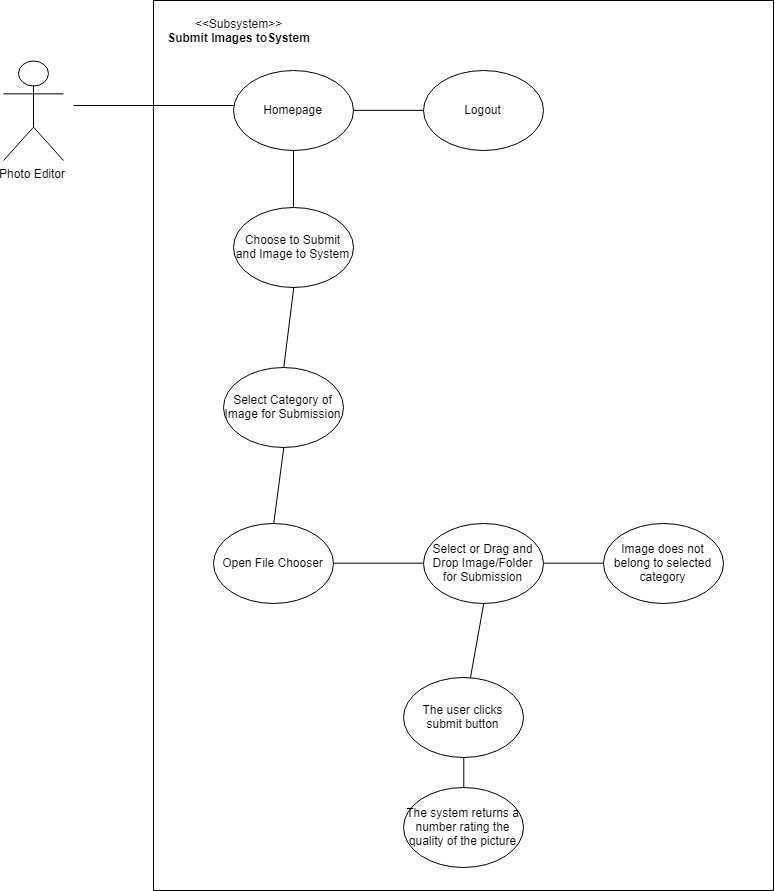
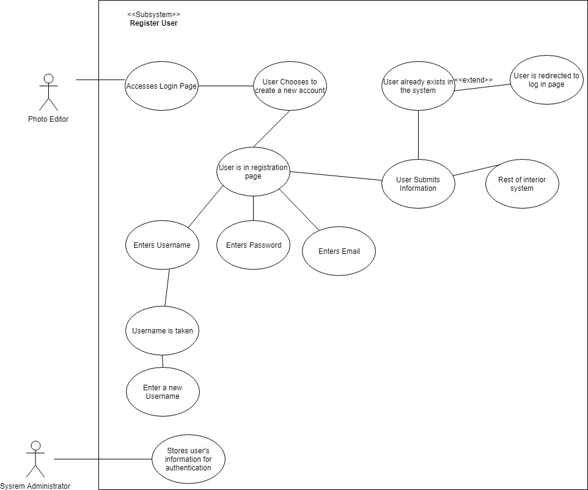
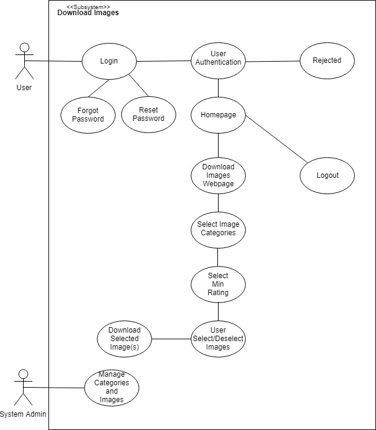

Use Case Description

Use Case 1: Logging into and out of the System

Description:

- The Photo Editor uses the login/logout subsystem to access and leave the rest of system&#39;s services.

Triggers:

- Https request to login page
- Forgot password action
- Reset password action
- Submit login credentials
- Logout of system

Actors

- Photo Editors
- Administrator
- System Services

Preconditions

- Photo Editor has an account registered to the system

Main Success Scenario

- Photo Editor enters Username and Password
- He or She submits login form
- If credentials are valid, then he or she is redirected to the site homepage where they have access to the system interior

Alternative Success Scenario

- If Password is forgotten, then the user can request to have an email sent to them in order to regain access to the system
- In order to reset a user&#39;s password, they request to have an email sent to them that will provide a temporary access code

Failed End Condition

- Invalid credentials are submitted and the Photo Editor is redirected to the login page

Extensions

- Forgot Password Functionality
- Reset Password Functionality

Steps of Execution

- The Photo Editor connects to the login page. Here he or she can reset their password, select the forgot password option, or enter their username and password. If their credentials are invalid, then they are redirected back to the homepage with an error message. If their credentials are valid, then they are redirected to their custom homepage that will display their courses. From here, he or she has access to the rest of the system&#39;s services and can logout whenever they desire. The Administrator manages the user accounts.

Content: Joshua Thompson

Peer Review: Milesh, Christopher

Use Case Description

Use Case 2: Submitting Images to System

Description:

- The Photo Editor logs into the system and submits an image of a category to the system

Triggers:

- Click File Chooser button
- Select Image or Folder to submit
- Drag Image or folder for submission
- Submit image/folder to the system

Actors

- Photo Editors

Preconditions

- Photo Editor has an account registered to the system and images of a particular category in his/her device for submitting to the system

Main Success Scenario

- The user chooses to submit an image or folder to the system
- The user chooses the category of image that will be submitted
- The user clicks file chooser button
- The user selects image that will be submitted to the system or drags and drops the image that will be submitted

Failed End Condition

- Photo does not belong to the category the user selected

Steps of Execution

- The user chooses to submit an image to the system. The user decides what the category of the image that will be submitted is. The user is in the submission page where he or she clicks on the file chooser to pick and image or folder that will be selected or dragged to the page for submission. The user clicks the submit button to submit the image. The system returns a number that trates the picture

Content: Milesh Shah

Peer Review: Joshua Thompson

Use Case Description

Use Case 3: Register User

Description:

- The new user of the system registers a username, password and email that he or she will use to gain access to the system.

Triggers:

- Https request to login page and registration page
- Submit user information such as username, password and email

Actors

- Photo Editors
- Administrator

Preconditions

- Photo editor does not have a registered account

Main Success Scenario

- Photo Editor goes to registration page
- Photo Editor enters username, password and email related to him or her
- Administrator stores photo editors authentication information

Alternative Success Scenario

- If the new user enters a username that is already in the system, the user can enter a new username that is not currently stored for any user.

Failed End Condition

- User already exists in the system

Extensions

- User is asked to sign in by being redirected to the login page if the user with the corresponding username and email already exist

Steps of Execution

- The Photo Editor connects to the login page. Then the user chooses to create a new account. After that choice the user is directed to a registration page where the user&#39;s username, password and email are entered and stored in the system by the system administrator after the user submits the information.

Content: Milesh Shah

Peer Review: Joshua Thompson

Use Case Description

Use Case 4: Download Images

Description:

- The user logs in to the site, and is able to select images for a given category and downloads images that receive at least the rating specified by the user

Triggers:

- Select Wanted Categories
- Select Minimum Rating Wanted
- Select Images to Download

Actors

- Photo Editors
- System Admin

Preconditions

- Photo Editor has an account registered to the system
- Photo Editor has submitted images to the system for rating

Main Success Scenario

- Photo Editor enters Username and Password
- He or She submits login form
- If credentials are valid, then he or she is redirected to the site homepage where they have access to the system interior
- The user clicks onto the download images webpage
- The user selects the categories they want to pull images for
- The user selects the minimum rating they want to pull images for
- The user chooses the image(s) they would like to download
- The user downloads the image(s)

Failed End Condition

- No images match the user request

Steps of Execution

- The Photo Editor connects to the login page, submits the login form and gets access to the login page. The user chooses to go to the download images webpage and selects the categories and the minimum rating they want to pull images for. From there, the user will be shown all of the images that match their request, where they will be able to choose the image(s) they would like to download. There will also be a select all option so that the user can quickly download all of the images that match their request. Once the user is ready, they will hit the download button to start the download of the images they selected.

Content: Christopher Foeller

Peer Review: Joshua Thompson, Milesh Shah

Purpose\Goal: Create a classifier that can determine which photos are of good quality and which photos are not of good quality on a sliding scale

Interface : Web interface

// additional feature after initial version

// initial build will keep the addition of this later functionality in mind

Photo editors will contribute to the supervised learning of the model

Workflow of System

- Login
- Submit folder of images to system
  - (optional) select category of images ex. Football, Pop-News, Mixed (default), etc.
- User is displayed a wall of the images that each show a rating
  - Can filter and sort based on given ratings
  - Can download images based on rating
- Logout

Use Cases :

- Login/Logout
- Register Account
- Submit images to system:

1. Select Category of Image
2. Drag and Drop Image/ Folder

- Download Images:

1. User can download images over a specified rating received for an images
2. User specifies the rating that an image must receive so that it may be downloaded